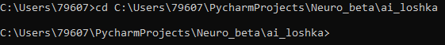

# 
`ИНСТРУКЦИЯ`

### **Данный мануал поможет вам запустить сия чудо**

***

**Первым делом установите все зависимости:**

* **Python 3.8**
* **Cuda 11.2 (Опционально)**
  * **Cudnn 8.5.0 for CUDA 11.x**

***

# 
`ЗАПУСК ЧЕРЕЗ UI.py`

  1. **Загруженный архив распаковываем в любую папку**
  2. **Заходим в папку которую мы разархивировали**
  3. **Два раза нажимаем на файл 'UI.py' и ждём запуска**

***

# 
`ЗАПУСК ЧЕРЕЗ КОНСОЛЬ`

1. **Загруженный архив распаковываем в любую папку**
2. **Открываем командную строку с правами администратора**
3. **Прописываем путь в корневую папку(папку которую вы разархивировали, в данной папке у вас должен находится файл UI.py) 
с помощью cd <small>(см. пример ниже)</small>**
4. **Пишем 'python UI.py' и ждём запуска**

***

# 
`Не заработало?`

**Возможно это поможет вам:**

* **Команды установки нужных библиотек вручную**
  * **pip install numpy==1.23.3**
  * **pip install tensorflow-gpu==2.10.0 (Опционально)**
    * **Для работы так же потребуется Cuda 11.2 и Cudnn for Cuda 8.5.0 11.x** 
  * **pip install tensorflow==2.10.0**
  * **pip install keras==2.10.0**
  * **pip install pyqt5==5.15.4**

**Проверьте верность указания пути в корневую папку, путь должен вести к папке в которой находится файл UI.py**

**Если вы получаете ошибку: `TypeError: int() argument must be a string, a bytes-like object or a number, not 'NoneType`,
просто запустите программу снова 'python UI.py'**

***

# 
`Не помогло?`

**Отправьте сообщение с ошибкой и/или скриншотом ошибки на почту: loshka.ai.help@gmail.com 
и держите связь с разработчиком**