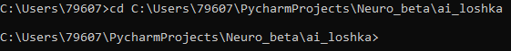

# 
`ИНСТРУКЦИЯ`

### **Данный мануал поможет вам запустить сия чудо**

***

**Первым делом установите все зависимости:**

* **Python 3.8**
* **Cuda 11.2 (Опционально)**
  * **Cudnn 8.5.0 for CUDA 11.x**

***

# 
`ЗАПУСК ЧЕРЕЗ КОНСОЛЬ`

1. **Открываем командную строку с правами администатора**
2. **Прописываем путь в корневую папку(папку в которой у вас находится UI.py) с помощью cd <small>(см. пример ниже)</small>**
3. **Пишем 'python UI.py' и ждём запуска**

***

# 
`Не заработало?`

**Возможно это поможет вам:**

* **Команды установки нужных библиотек вручную**
  * **pip install numpy==1.23.3**
  * **pip install tensorflow-gpu==2.9.1 (Опционально)**
    * **Для работы потребуется так же Cuda 11.2 и Cudnn for Cuda 8.5.0 11.x** 
  * **pip install tensorflow==2.9.1**
  * **pip install keras==2.9.0**

**Проверьте верность указания пути в корневую папку, путь должен вести к папке в которой находится файл UI.py**

***

# 
`Не помогло?`

**Отправьте сообщение с ошибкой и/или скриншотом ошибки на почту: loshka.ai.help@gmail.com 
и держите связь с разработчиком**